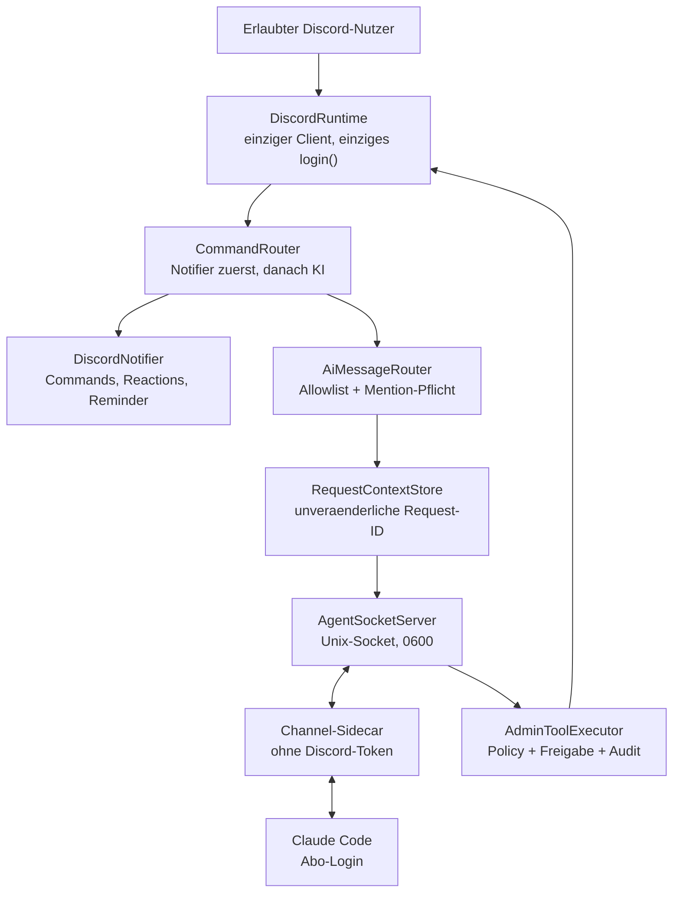

# KI-Agent: Architektur (Phase 1)

Stand: 3. September 2026 · Umgesetzt: Phase 1 des
[Umsetzungsplans](../gpu-search-claude-discord-umsetzungsplan-ein-bot.md).

## Ein Bot, ein Client, ein Login

## Komponenten

| Datei | Aufgabe |
|---|---|
| `src/integrations/discord/runtime/discordRuntime.ts` | Besitzt den einzigen `Client`. `login()` ist idempotent und ruft `client.login()` genau einmal auf. |
| `src/integrations/discord/routing/commandRouter.ts` | Fan-out für `messageCreate`/`interactionCreate` in Registrierungsreihenfolge, mit Fehlerisolation. Der erste Handler, der `true` liefert, beendet die Kette. |
| `src/integrations/discord/routing/reactionRouter.ts` | Unveränderter Emoji-Dispatcher (B5/C1/C2/D). |
| `src/integrations/discord/routing/aiMessageRouter.ts` | Torwächter: Guild, Channel-Allowlist, User-Allowlist, Mention-Pflicht, keine Bots/Webhooks, kein laufender Notifier-Dialog. |
| `src/integrations/discord/ai/requestContextStore.ts` | Erzeugt pro zugelassener Nachricht eine eingefrorene Request-ID mit Absender, Guild, Channel, Message-ID und Ablaufzeit. |
| `src/integrations/discord/ai/agentSocketServer.ts` | Unix-Socket (0600) mit Secret-Handshake und NDJSON-Frames. |
| `src/integrations/discord/ai/toolPolicy.ts` | Deterministische Risikomatrix. Default-Deny für unbekannte Tools. |
| `src/integrations/discord/ai/approvalService.ts` | Argumentgebundene, einmalige, ablaufende Owner-Freigaben. |
| `src/integrations/discord/ai/adminToolExecutor.ts` | Führt Tools aus – erst nach Kontext, Policy, Registrierung und Freigabe. |
| `src/integrations/discord/ai/auditLog.ts` | Append-only JSONL mit Redaction. |
| `src/integrations/discord/ai/agentModule.ts` | Kompositionswurzel; wird von `bootstrap.ts` nur bei `AI_AGENT_ENABLED=true` gestartet. |
| `tools/claude-gpu-search-channel/` | Sidecar ohne Discord-Abhängigkeit und ohne Token. |

## Vertrauensgrenze

Der GPU-Search-Prozess entscheidet allein. Sidecar und Claude bekommen:

- die `requestId` (Zufalls-UUID) und den Nachrichtentext,
- niemals Bot-Token, Absender-ID oder Guild-ID als schreibbares Argument.

`AdminToolExecutor` entfernt `guild_id`, `guildId`, `actor`, `actorUserId`, `userId`,
`requestId` und `approvalId` aus den Toolargumenten und setzt Guild und Absender aus
Konfiguration bzw. `RequestContextStore`.

## Was Phase 1 bewusst noch nicht tut

- Es ist **kein** Admin-Tool registriert (`executor.registeredTools` ist leer). Jeder
  Toolaufruf endet mit `tool is not registered` — das ist Phase 2.
- Die Owner-DM mit Allow-/Deny-Buttons fehlt noch; `AdminToolExecutorOptions.requestApproval`
  ist der vorgesehene Einhängepunkt (Phase 3).
- Die Frame-Namen des stdio-Kanals sind noch nicht gegen den gepinnten Upstream-Commit
  des offiziellen Plugins abgeglichen (siehe `tools/claude-gpu-search-channel/THIRD_PARTY_NOTICES.md`).
