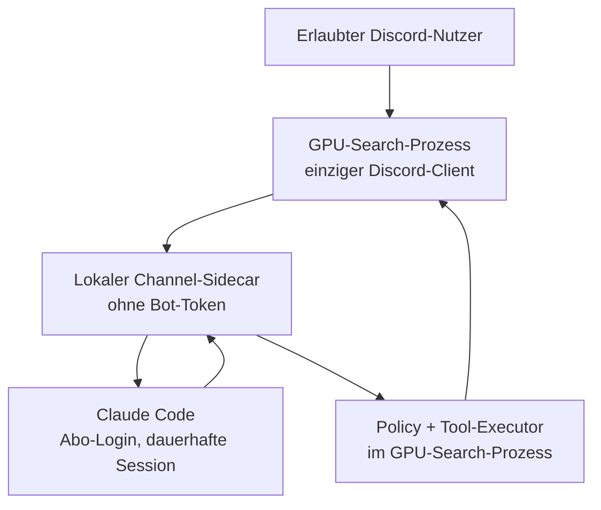

# Umsetzungsplan: `gpu-search` als Claude-gestützter Discord-Administrator

Stand der Prüfung: **2. September 2026**  
Geprüfter Repository-Stand: **`illuuuuusion/gpu-search`, Branch `main`, Commit `257d640`**  
Zielgruppe: Coding-KI, die den Plan schrittweise im Repository umsetzt

## 1. Kurzentscheidung

**QuadsLab allein reicht für das Ziel nicht aus.** `@quadslab.io/discord-mcp` stellt Discord-Admin-Werkzeuge bereit, ist aber kein Eingangskanal, der Discord-Nachrichten an eine laufende Claude-Code-Session weiterleitet. Das offizielle Claude-Code-Discord-Plugin übernimmt genau diesen Transport, besitzt aber nur Werkzeuge für Antworten, Reactions, Nachrichtenbearbeitung, Verlauf und Attachments.

Die verbindliche Vorgabe lautet: **Es bleibt bei genau einer Discord-Bot-Identität, dem vorhandenen `gpu-search`-Bot.**

Die empfohlene Zielarchitektur lautet deshalb:

1. Der vorhandene `gpu-search`-Prozess bleibt alleiniger Besitzer des Bot-Tokens und des einzigen Discord-Gateway-Clients.
2. Seine Discord-Integration wird vor der Erweiterung aus der großen `notifier.ts` in klar getrennte Runtime-, Routing- und Feature-Komponenten zerlegt.
3. Ein lokaler Claude-Channel-Sidecar verbindet den bestehenden Bot über einen geschützten Unix-Socket mit einer dauerhaft laufenden Claude-Code-Session. Der Sidecar besitzt **keinen Discord-Token** und öffnet **keine Discord-Gateway-Verbindung**.
4. Das offizielle Claude-Code-Discord-Plugin wird nicht unverändert installiert, sondern dient als geprüfte Vorlage für Channel-Protokoll, Access-Modell, Antwortwerkzeuge und Permission-Weiterleitung.
5. Eine **kuratierte Teilmenge** der QuadsLab-Admin-Tools wird auf den bereits vorhandenen `discord.js`-Client des GPU-Search-Prozesses adaptiert.
6. Vor jedem schreibenden Tool erzwingt der GPU-Search-Prozess eine deterministische Policy-Schicht außerhalb des Sprachmodells.
7. Destruktive Werkzeuge bleiben in V1 deaktiviert; Freigaben erfolgen über Owner-DMs des vorhandenen Bots.

Damit existiert nur:

- **ein Discord-Bot:** `gpu-search`
- **ein Discord-Gateway-Client:** im bestehenden Node.js-Prozess
- **ein Bot-Token:** ausschließlich im bestehenden Prozess
- **ein lokaler Claude-Sidecar:** ohne Discord-Zugangsdaten, nur für das Claude-Code-Channel-Protokoll

**Nicht zulässig:** das offizielle Plugin oder QuadsLab zusätzlich unverändert mit dem vorhandenen Bot-Token starten. Beide würden weitere Discord-Gateway-Clients öffnen. Stattdessen werden nur die benötigten Konzepte und Toolhandler in die neue Ein-Bot-Architektur übernommen.

Diese Vorgabe erhöht gegenüber zwei getrennten Bots den möglichen Schadensumfang des vorhandenen Tokens, weil Scanner und Admin-Funktionen dieselbe Discord-Rolle verwenden. Deshalb sind minimale Discord-Rechte, geschützte Ziele, externe Freigaben und eine serverseitige Tool-Policy zwingende Bestandteile – keine optionalen Härtungen.

## 2. Ergebnis der Bestandsprüfung

### 2.1 Reifephase des Bots

Der Bot ist **kein früher Prototyp mehr**, aber auch noch **nicht produktionsreif**:

- funktional umfangreicher Stand mit GPU-Scanner, Discord-Commands, Reactions, Admin-Hilfen, Valorant-Domain, Persistenz, Retries und Observability;
- Paketversion weiterhin `0.1.0`;
- kein erkennbarer produktiver Deployment- oder CI-Workflow;
- der letzte Commit des geprüften `main`-Branches ist vom 10. Juli 2026;
- mehrere Features sind implementiert, aber noch nicht live mit echten Discord-/eBay-Daten abgenommen;
- Dokumentation und Planstatus entsprechen nicht mehr dem Code.

Einschätzung: **Feature-Complete Development Build / Vorstufe zur Beta.** Vor der KI-Integration ist eine kurze Stabilisierungs- und Abnahmephase notwendig.

### 2.2 Automatische Prüfung

Nach einer sauberen Installation der Lockfile-Abhängigkeiten:

- `tsc --noEmit -p tsconfig.json`: **grün**
- Build mit `tsc -p tsconfig.json`: **grün**
- Tests: **73/73 grün**
- `npm audit --omit=dev`: **6 bekannte Produktions-Abhängigkeitsprobleme**, davon 4 mit Einstufung `high`

Der normale Befehl `npm test` konnte in der isolierten Prüfumgebung den `tsx`-IPC-Socket für das Clean-Skript nicht öffnen. Der gleiche Build-/Testpfad wurde deshalb ohne `tsx` ausgeführt. Das ist kein nachgewiesener Fehler des Repos.

Während des ansonsten grünen Testlaufs trat jedoch mehrfach ein realer Warnpfad auf:

```text
ENOENT: rename '...scanner-state.json.tmp' -> '...scanner-state.json'
```

Ursache: `writeFileAtomic()` verwendet pro Zieldatei immer denselben festen `.tmp`-Pfad. Überlappende Writes können sich dadurch gegenseitig die Temp-Datei wegnehmen. Einige Aufrufer protokollieren den Persistenzfehler nur und lassen den Test trotzdem bestehen. **Dieser Race Condition muss vor der KI-Erweiterung Priorität gegeben werden.**

### 2.3 Repository-Hygiene

Trotz `.gitignore` sind im Commit noch vorhanden:

- **4.866 Dateien unter `node_modules/`**
- **4 generierte Dateien unter `dist/`**
- `matrix-bot.json` mit nicht erklärtem Laufzeit-/Sync-State

Das Git-Pack ist dadurch etwa 29 MiB groß. Vor weiteren großen Änderungen sollen generierte Abhängigkeiten aus dem Index entfernt und `matrix-bot.json` auf Sensibilität und Notwendigkeit geprüft werden.

## 3. Status des vorhandenen `PLAN.md`

| Punkt | Status im Code | Vor KI-Integration noch nötig |
|---|---|---|
| A1 Secrets aus Dateien + Log-Redaction | umgesetzt | echter Starttest mit Secret-Dateien; Doku aktualisieren |
| A2 atomare Writes + Backups | umgesetzt, aber mit Race Condition | eindeutige Temp-Datei oder serialisierte Writes; Konkurrenztest ergänzen |
| A5 Domain-Fehlerisolation | umgesetzt | manueller Fehler-/Restart-Test |
| A4 Property-based Tests | umgesetzt | in CI ausführen |
| A3 OpenTelemetry/Prometheus | umgesetzt | optionaler Smoke-Test mit aktiviertem Endpoint |
| A7 Reaction-Infrastruktur/Allowlist | umgesetzt | echte Discord-Abnahme laut `TODO-USER.md` |
| B5 adaptive Akzeptanzschwelle | umgesetzt | Praxiskalibrierung |
| C1 Dream-Deal-Score | umgesetzt | Praxiskalibrierung |
| C2 Fehltreffer/Ausschlüsse | umgesetzt | echte Reaction- und Schutztestfälle |
| D Auktions-Reminder | umgesetzt | echte Auktion und Neustart testen |
| A6 Liquipedia | bewusst nicht umgesetzt | nicht nachholen, solange VLR aktiv bleibt |
| B6 Alias-Fallback | als regelbasiertes Logging umgesetzt | reale Treffer beobachten; noch kein Live-Alarm |
| B2 Deal-Timing | auf eigener Historie umgesetzt | erst mit genügend Laufzeitdaten aussagekräftig |
| B4 Kleinanzeigen-Arbitrage | Codegerüst umgesetzt, nicht produktiv validiert | ToS-Entscheidung, Live-Selektoren und reale Margentests; bis dahin deaktiviert lassen |

Fazit: Der alte Plan darf **nicht noch einmal implementiert** werden. Er muss archiviert bzw. als erledigt/teilweise erledigt markiert werden. Offen sind vor allem Abnahme, Betrieb und zwei konkrete technische Schulden.

## 4. Was die beiden Fremdprojekte tatsächlich leisten

### Offizielles Claude-Code-Discord-Plugin

Das offizielle Plugin ist ein bidirektionaler Claude-Code-Channel. Es kann Discord-Nachrichten in eine laufende Claude-Code-Session einspeisen und stellt aktuell fünf Kommunikationswerkzeuge bereit:

- `reply`
- `react`
- `edit_message`
- `fetch_messages`
- `download_attachment`

Es bietet Pairing, User-Allowlist, freigegebene Guild-Channels, Mention-Pflicht und eine Weiterleitung von Claude-Code-Permission-Prompts an erlaubte DMs. Channels funktionieren nur, solange die Claude-Code-Session läuft, und befinden sich noch im Research Preview.

Quellen: [Claude Code Channels](https://code.claude.com/docs/en/channels), [Channels Reference](https://code.claude.com/docs/en/channels-reference), [offizielles Discord-Plugin](https://github.com/anthropics/claude-plugins-official/tree/main/external_plugins/discord)

### QuadsLab Discord MCP

QuadsLab bietet laut aktuellem README 139 Werkzeuge in 20 Kategorien, unter anderem Rollen, Channels, Mitglieder, Moderation, Nachrichten, Threads, Webhooks, AutoMod und Audit Log. Das deckt den fachlichen Admin-Funktionsumfang weitgehend ab.

Es fehlen für dieses Vorhaben jedoch wichtige Schutzschichten:

- kein Discord-zu-Claude-Inbound-Channel;
- keine eigene User-/Channel-Allowlist für Toolaufrufe;
- keine interne Freigabe- oder Risikoklassifizierung;
- keine V1-Sperre für destruktive Werkzeuge;
- kein Testskript und keine mitgelieferte Testsuite im geprüften Stand;
- direkter `npx`-Betrieb wäre ungepinnt;
- das Setup empfiehlt sogar die Discord-Berechtigung `Administrator` als bequeme Option;
- ein Audit der aktuellen Lockfile meldete mehrere bekannte Abhängigkeitsprobleme.

QuadsLab ist daher **eine gute Funktionsbibliothek und Referenz**, aber keine vertrauenswürdige Sicherheitsgrenze. Es soll gepinnt, geprüft und nur teilweise übernommen werden.

Quelle: [QuadsLab Discord MCP](https://github.com/HardHeadHackerHead/discord-mcp)

## 5. Zielarchitektur



### Vertrauensgrenzen

Der GPU-Search-Prozess ist die einzige vertrauenswürdige Discord-Grenze:

- Er prüft User-ID, Channel-ID, Guild-ID und Mention-Pflicht **vor** der Weiterleitung an Claude.
- Er erzeugt eine unveränderliche Request-ID und bindet daran Absender, Ursprungskanal und ursprüngliche Discord-Message-ID.
- Der Sidecar und Claude dürfen diese Identität nicht selbst als Toolargument setzen oder überschreiben.
- Admin-Aufrufe kommen über denselben lokalen Socket zurück, werden aber erst nach erneuter Policy-Prüfung ausgeführt.
- Nur der GPU-Search-Prozess darf den Discord-API-Client verwenden.

### Lokale Verbindung

Für Linux/Docker wird ein Unix-Domain-Socket unter einem nicht öffentlichen Runtime-Verzeichnis verwendet. Der Socket erhält restriktive Dateirechte; zusätzlich authentifizieren sich beide Prozesse mit einem zufälligen lokalen Secret aus einer Datei. Es wird kein frei erreichbarer HTTP-Port geöffnet.

Das Protokoll benötigt mindestens:

- `inbound_message`: autorisierte Discord-Nachricht an Claude übergeben;
- `reply` / `react` / `edit_message`: Antwort durch den vorhandenen Bot senden;
- `admin_tool_request`: normalisierten Toolaufruf an den GPU-Search-Prozess senden;
- `approval_status`: Freigabe, Ablehnung oder Ablauf melden;
- `health`: Sidecar- und Claude-Verfügbarkeit prüfen.

Fällt Claude oder der Sidecar aus, laufen GPU-Scanner, Valorant, Slash-Commands, Reactions und Reminder weiter. Der Bot antwortet auf Agent-Anfragen kontrolliert mit „KI-Funktion derzeit nicht verfügbar“, statt Nachrichten unbegrenzt zu puffern.

## 6. Verbindliche Reihenfolge

### Phase 0 – Bestehenden Bot stabilisieren und alten Plan abschließen

Diese Phase muss vollständig abgeschlossen sein, bevor Admin-Rechte an einen KI-Agenten gehen.

#### 0.1 Persistenz-Race beheben

Betroffene Datei: `src/app/shared/atomicFile.ts`

Umsetzung:

1. Pro Schreibvorgang einen eindeutigen Temp-Pfad verwenden, z. B. mit PID plus Zufalls-/UUID-Anteil.
2. Zusätzlich Writes pro Zieldatei serialisieren, damit Backup-Rotation und Hauptdatei atomar als eine Operation behandelt werden.
3. Temp-Dateien in `finally` best effort entfernen.
4. `fsync` für Datei und – soweit sinnvoll/portabel – Parent Directory prüfen.
5. Einen Parallelitätstest ergänzen: mindestens 20 gleichzeitige Writes auf dasselbe Ziel; kein `ENOENT`, gültiges JSON, keine verwaiste Temp-Datei.
6. Tests dürfen Persistenzwarnungen nicht still als Erfolg akzeptieren.

Abnahmekriterien:

- 73 bestehende Tests plus neuer Konkurrenztest grün;
- Testausgabe enthält keinen State-Persistenzfehler;
- Backup-Rotation bleibt korrekt.

#### 0.2 Abhängigkeiten und Repository bereinigen

Umsetzung:

1. Produktionsabhängigkeiten auf gepatchte kompatible Versionen aktualisieren; insbesondere `axios`, `discord.js` und deren Transitives.
2. `npm audit --omit=dev` auf 0 bekannte High/Critical Findings bringen oder jede verbleibende Ausnahme begründen.
3. `node_modules/` und `dist/` aus dem Git-Index entfernen; `.gitignore` beibehalten.
4. `matrix-bot.json` prüfen. Falls Laufzeitstate oder Credential: aus Git entfernen, Credential rotieren und durch Beispiel-/Schema-Datei ersetzen. Falls harmlos: Zweck dokumentieren.
5. `engines.node` passend zum Dockerfile festlegen und Node-Version in CI pinnen.
6. `PLAN.md` mit Status versehen oder nach `docs/archive/` verschieben; `TODO-USER.md` als echte Abnahmecheckliste behalten.
7. README aktualisieren: bereits vorhandene Retries, Persistenz, Reactions, Observability und aktuelle Grenzen korrekt beschreiben.

Abnahmekriterien:

- frischer Clone → `npm ci` → `npm run lint` → `npm test` funktioniert;
- kein `node_modules/` oder generiertes `dist/` mehr getrackt;
- keine unbegründeten High/Critical Audit-Funde.

#### 0.3 CI und reale Abnahme

Umsetzung:

1. GitHub Actions Workflow für `npm ci`, `npm run lint`, `npm test` und `npm audit --omit=dev` ergänzen.
2. Die Punkte aus `TODO-USER.md` in dieser Reihenfolge manuell abnehmen:
   - Reactions + Allowlist
   - C2 Fehltreffer
   - C1 Dream Deal
   - D Auktions-Reminder inklusive Neustart
   - B2 erst nach ausreichender Historie bewerten
   - B6 Alias-Log beobachten
3. B4 weiterhin `false` lassen, bis Recht/ToS und Live-Parser geprüft sind.
4. A6 nicht umsetzen; toten Liquipedia-Code separat entfernen oder mit einer klaren Entscheidung dokumentieren.

Abnahmekriterien:

- CI grün;
- manuelle Resultate mit Datum in `docs/acceptance/current-bot.md` dokumentiert;
- keine KI-Integration ändert das Verhalten der bestehenden Scanner- und Valorant-Funktionen.

### Phase 1 – Architektur- und Sicherheitsgerüst im Repo

Neue Struktur:

```text
src/integrations/discord/
  runtime/
    discordRuntime.ts
  routing/
    commandRouter.ts
    reactionRouter.ts
    aiMessageRouter.ts
  ai/
    agentSocketServer.ts
    requestContextStore.ts
    toolPolicy.ts
    approvalService.ts
    adminToolExecutor.ts
    auditLog.ts
tools/claude-gpu-search-channel/
  package.json
  src/
    channel/
    socketClient/
    tools/
  test/
  README.md
  THIRD_PARTY_NOTICES.md
docs/ai-agent/
  architecture.md
  threat-model.md
  operations.md
.claude/
  settings.example.json
```

Umsetzung:

1. Die bestehende `DiscordNotifier`-Klasse schrittweise zerlegen, ohne Verhalten zu ändern. `discordRuntime.ts` erzeugt und besitzt den einzigen `Client`; bestehende Commands, Reactions, Welcome- und Moderationsfunktionen bekommen den Client per Dependency Injection.
2. Bestehende Discord-Regressionstests vor dem Refactor erweitern. Erst wenn der Refactor grün ist, die KI-Funktion hinzufügen.
3. `aiMessageRouter.ts` ergänzen. Er verarbeitet nur Nachrichten, wenn alle Bedingungen erfüllt sind:
   - `AI_AGENT_ENABLED=true`;
   - richtige Guild-ID;
   - Channel und User in der Allowlist;
   - Bot explizit erwähnt oder Antwort auf eine Bot-Agent-Nachricht;
   - Nachricht stammt nicht von einem Bot/Webhook;
   - Nachricht gehört nicht zu einem laufenden C2-/Command-Dialog.
4. In `requestContextStore.ts` für jede zugelassene Nachricht serverseitig einen unveränderlichen Kontext speichern: Request-ID, User-ID, Guild-ID, Channel-ID, Message-ID, Zeitstempel und Ablaufzeit. Nur diese Request-ID wird an Claude weitergereicht.
5. Im Workspace ein eigenes Claude-Channel-Sidecar-Paket anlegen. Es implementiert das Channel-Protokoll über stdio zu Claude Code und spricht lokal per Unix-Socket mit `gpu-search`. Es importiert **kein `discord.js`**, liest keinen Bot-Token und öffnet keinen Netzwerkport.
6. Den offiziellen Plugin-Stand auf einen konkreten Commit pinnen und nur Channel-Protokoll, Nachrichtendarstellung, Reply-Semantik und Permission-UX als Vorlage/übernehmbaren Code verwenden. Direkten Discord-Login aus dem Plugin nicht übernehmen.
7. QuadsLab ebenfalls auf einen konkreten Commit pinnen. Tool-Schemas und ausgewählte Handler auf Dependency Injection bzw. den zentralen `DiscordRuntime`-Client anpassen; keinen QuadsLab-Client starten. Lizenz-/Copyright-Hinweise erhalten.
8. Neue Konfiguration mit Zod ergänzen:
   - `AI_AGENT_ENABLED=false`
   - `AI_SOCKET_PATH=data/runtime/claude-channel.sock`
   - `AI_SOCKET_SECRET_FILE=...`
   - `AI_ALLOWED_USER_IDS=...`
   - `AI_OWNER_USER_IDS=...`
   - `AI_ALLOWED_CHANNEL_IDS=...`
   - `AI_REQUIRE_MENTION=true`
   - `AI_APPROVAL_TTL_SECONDS=300`
9. Bot-Token bleibt ausschließlich unter `DISCORD_BOT_TOKEN` bzw. `DISCORD_BOT_TOKEN_FILE` im Hauptprozess. Der Sidecar darf diese Variable nicht erben; beim Spawn/Service-Setup eine explizite Minimal-Environment verwenden.
10. Claude Code ausschließlich über offiziellen Claude.ai-Abo-Login betreiben; keinen Anthropic-API-Key in dieses Projekt aufnehmen.
11. Den vorhandenen Bot im Discord Developer Portal nur um tatsächlich benötigte granulare Rechte erweitern. Keine `Administrator`-Berechtigung.

Abnahmekriterien:

- bestehende und neue Funktionen verwenden nachweislich dasselbe `Client`-Objekt;
- im gesamten Prozessverbund erfolgt genau ein Aufruf von `client.login()`;
- der Sidecar startet ohne Discord-Token und enthält keine `discord.js`-Abhängigkeit;
- fremde Nutzer, Webhooks und nicht freigegebene Guild-Channels werden still verworfen;
- Agent-Nachrichten kollidieren nicht mit bestehenden Commands oder C2-Follow-ups;
- Start mit aktivierter KI-Funktion, aber ohne gültige Owner-/User-/Channel-Allowlist oder Socket-Secret schlägt hart fehl;
- bei deaktivierter oder ausgefallener KI funktionieren sämtliche bisherigen Bot-Funktionen weiter.

### Phase 2 – Read-only Admin-MVP

Zuerst ausschließlich lesende Werkzeuge integrieren:

- `get_guild_info`
- `list_channels`
- `view_channel_permissions`
- `list_roles`
- `get_role_permissions`
- `list_members` / `get_member`
- `get_member_permissions`
- `get_audit_log`
- `list_bans`
- `list_invites`
- `list_webhooks`
- `list_automod_rules`
- `get_messages` mit hartem Limit
- Thread-/Forum-Listenfunktionen nur bei Bedarf

Schutzregeln:

1. Guild-ID wird serverseitig aus Konfiguration genommen, nie frei vom Modell gewählt.
2. Maximalwerte für Listen und Message-History erzwingen.
3. Keine DMs an Mitglieder in diesem Meilenstein.
4. Sensitive Felder, Tokens und unnötige personenbezogene Daten aus Toolantworten entfernen.
5. Der Sidecar reicht nur Toolname, fachliche Argumente und die vom Hauptprozess ausgestellte Request-ID zurück. Die Identität des Auftraggebers wird im Hauptprozess aus `requestContextStore` geladen.
6. Der `adminToolExecutor` im GPU-Search-Prozess führt den Aufruf über den zentralen `DiscordRuntime` aus; der Sidecar berührt Discord nie direkt.
7. Read-only-Werkzeuge dürfen in Claude Code explizit erlaubt werden; alle unbekannten MCP-Tools bleiben `ask` oder `deny`.

Abnahmekriterien:

- Frage in Discord: „Zeige mir Rollen und Channelstruktur“ liefert korrekte, begrenzte Daten;
- kein Tool dieses Meilensteins verändert Discord-Zustand;
- Unit-Tests beweisen, dass fremde Guild-IDs und übergroße Limits abgelehnt werden.

### Phase 3 – Reversible Schreiboperationen mit Freigabe

Danach eine kleine Auswahl schreibender Werkzeuge ergänzen:

- `send_message`
- `create_text_channel`, `create_voice_channel`, `create_category`
- `modify_channel`, `reorder_channels`
- `create_role`, `modify_role`
- `assign_role`, `remove_role`
- `set_channel_permissions`
- `set_slowmode`, `lock_channel`, `unlock_channel`
- `timeout_member` mit begrenzter Maximaldauer

Policy außerhalb des LLM:

1. Jeder Write erzeugt im GPU-Search-Prozess zuerst eine normalisierte Vorschau (`actor`, `guild`, Tool, Ziel-ID, Diff, Grund). `actor` und `guild` stammen ausschließlich aus dem gespeicherten Request-Kontext.
2. Der vorhandene Bot sendet die Vorschau mit Allow-/Deny-Buttons per DM an einen Account aus `AI_OWNER_USER_IDS`.
3. Der freigegebene Hash muss exakt zu Toolname und normalisierten Argumenten passen; eine Freigabe darf nicht für geänderte Argumente wiederverwendet werden.
4. Freigaben laufen nach fünf Minuten ab und sind einmalig.
5. Die Person, die eine Operation in einem Guild-Channel anstößt, darf nicht automatisch die Freigabe erteilen, sofern sie nicht zusätzlich in `AI_OWNER_USER_IDS` steht.
6. Bot-Rolle, Owner, Managed Roles, `@everyone` und konfigurierbare geschützte Channels/Roles sind unveränderbar.
7. Jede Operation erhält einen Discord-Audit-Log-Grund mit Request-ID.
8. Der Main-Prozess hält die Toolanfrage höchstens bis zum konfigurierten Timeout offen; bei Neustart, Socket-Abbruch oder Claude-Abbruch wird sie abgelehnt.

Abnahmekriterien:

- keine Write-Operation ohne gültige Owner-Freigabe;
- manipulierte, abgelaufene und doppelt verwendete Freigaben werden abgelehnt;
- Tests decken Rollenhierarchie, geschützte Ziele und Prompt-Injection-Texte ab;
- vollständiger lokaler Audit-Datensatz ohne Secrets.

### Phase 4 – Destruktive Werkzeuge getrennt behandeln

In V1 standardmäßig **nicht registrieren**:

- `delete_channel`
- `delete_role`
- `kick_member`
- `ban_member`, `bulk_ban`
- `prune_members`
- `bulk_delete_messages`, `purge_user_messages`
- `delete_webhook`, `delete_integration`
- `edit_server`
- Server-Template-/Onboarding-/Application-Command-Mutationen

Erst nach stabiler Nutzung dürfen einzelne Funktionen freigeschaltet werden. Dann gelten zusätzlich:

1. Zwei-Schritt-Dialog: Plan anzeigen, danach separate Bestätigung.
2. Exakte Zielauflistung, kein fuzzy Match bei destruktiven Aktionen.
3. Kleine Batch-Limits.
4. Vorher Snapshot der betroffenen Konfiguration.
5. Wo technisch möglich Kompensations-/Rollback-Aktion vorbereiten.
6. `ban`, `kick`, `prune` und Löschungen nie durch allgemeine „immer erlauben“-Regeln freigeben.

Abnahmekriterien:

- destruktive Tools sind ohne explizites Feature-Flag gar nicht sichtbar;
- IDs sind Pflicht, Namen allein genügen nicht;
- End-to-End-Tests finden ausschließlich in einer Wegwerf-Test-Guild statt.

### Phase 5 – Betrieb und optionale GPU-spezifische Agent-Tools

Umsetzung:

1. `gpu-search` und Claude Code/Channel-Sidecar als zwei überwachte Prozesse betreiben, aber mit nur einer Discord-Bot-Identität. Channels empfangen nur bei laufender Claude-Session Ereignisse.
2. Healthcheck für Hauptprozess, lokalen Socket, Claude-Prozess, Discord-Verbindung und Tool-Policy ergänzen.
3. Restart-Verhalten testen; Allowlist und offene Freigaben sicher persistieren. Offene Freigaben beim Neustart invalidieren.
4. Logs rotieren, Backups und Updateprozess dokumentieren.
5. Erst danach kleine GPU-spezifische MCP-Tools direkt im bestehenden Hauptprozess anbieten:
   - `gpu_get_scan_status`
   - `gpu_list_recent_alerts`
   - `gpu_get_market_summary`
   - `gpu_trigger_scan` als freigabepflichtiger Write
6. Diese GPU-Tools verwenden die vorhandenen Domain-Bindings und keine direkten Schreibzugriffe auf JSON-State-Dateien.
7. Kein allgemeines Shell- oder Dateisystem-Tool über Discord freigeben. Claude Code soll im Projektverzeichnis mit engstmöglichen Berechtigungen laufen.

Abnahmekriterien:

- dokumentierter Recovery-Test nach Prozessneustart;
- der Agent kann GPU-Zustand lesen, ohne direkte State-Dateien zu verändern;
- Scanner läuft weiter, wenn Claude oder der Channel-Sidecar ausfällt;
- der Bot-Token ist nur im Environment des GPU-Search-Hauptprozesses vorhanden.

## 7. Werkzeug-Risikomatrix für V1

| Klasse | Beispiele | Standard |
|---|---|---|
| Read | Rollen/Channels/Audit-Log auflisten | automatisch erlaubt, begrenzt |
| Low Write | Nachricht senden, Slowmode setzen | Owner-Freigabe |
| Structural Write | Channel/Rolle erstellen oder ändern, Permissions setzen | Owner-Freigabe + Diff |
| Moderation | Timeout | Owner-Freigabe + Dauerlimit |
| Destructive | Löschen, Kick, Ban, Prune, Bulk Delete | in V1 nicht registriert |
| External/Exfiltration | Webhooks erstellen, DMs, Attachments herunterladen, beliebige URLs | standardmäßig gesperrt |

## 8. Tests, die die Coding-KI liefern muss

### Unit-Tests

- Allowlist für User, Channel und Guild
- Mention-Pflicht
- Toolklassifizierung vollständig: jedes registrierte Tool hat genau eine Risikoklasse
- unbekanntes Tool wird abgelehnt
- Freigabe-Hash, Ablaufzeit, Single Use
- geschützte Rollen/Channels/Owner
- exakte ID-Pflicht für destruktive Ziele
- Audit-Redaction
- Konkurrenztest für atomare State-Writes

### Integrationstests

- Mock-Discord-Client, kein echter Token in CI
- Inbound Message im bestehenden Client → Unix-Socket → Channel Event → Claude-Reply-Tool → Unix-Socket → Antwort desselben Clients
- bestehende Slash-Commands, Reactions, Reminder und KI-Mentions laufen über denselben gemockten Client
- Sidecar erhält nachweislich keinen Bot-Token
- Read Tool ohne Freigabe
- Write Tool bleibt bis Freigabe blockiert
- Deny und Timeout der Freigabe
- Neustart verwirft offene Freigaben
- Rate-Limit-/Retry-Pfade

### Manueller Test in Wegwerf-Guild

1. nicht erlaubter Nutzer und nicht erlaubter Channel;
2. erlaubte Read-Anfrage;
3. reversible Channel-/Rollenänderung mit DM-Freigabe;
4. Prompt Injection in normaler Servernachricht;
5. Versuch, geschützte Rolle oder `@everyone` zu ändern;
6. Versuch eines deaktivierten Destructive Tools;
7. Claude-Neustart und Discord-Reconnect.

## 9. Definition of Done

Die erste produktiv nutzbare Version gilt nur als fertig, wenn:

- Phase 0 vollständig abgeschlossen ist;
- das bestehende `gpu-search`-Verhalten unverändert grün bleibt;
- QuadsLab nicht ungepinnt per `npx` geladen wird;
- ausschließlich der vorhandene GPU-Search-Bot verwendet wird;
- der Bot-Token nur im Hauptprozess liegt und nicht an Claude oder den Sidecar weitergegeben wird;
- im gesamten System genau ein Discord-Gateway-Client und ein `client.login()` existieren;
- alle Discord-Aktionen – Scanner, Commands, Antworten und Admin-Tools – über den zentralen `DiscordRuntime` laufen;
- User-, Channel- und Guild-Allowlist serverseitig gelten;
- unbekannte und destruktive Tools standardmäßig blockiert sind;
- jeder Write eine externe, argumentgebundene Owner-Freigabe verlangt;
- Audit Trail und Discord Audit Reason gesetzt werden;
- keine High/Critical Dependency Findings unbegründet bleiben;
- der End-to-End-Test in einer Test-Guild dokumentiert ist;
- Betrieb und Recovery beschrieben sind.

## 10. Arbeitsanweisung für die Coding-KI

Diese Regeln sind beim Abarbeiten verbindlich:

1. Immer nur **eine Phase** bearbeiten und danach Bericht, Diff-Zusammenfassung und Testergebnis liefern.
2. Vor jeder Phase den aktuellen Branch/Commit, Working-Tree-Status und relevante Dateien erneut prüfen.
3. Keine bereits implementierten Punkte aus `PLAN.md` neu bauen.
4. Keine echten Tokens, User-IDs oder Guild-IDs committen.
5. Keine fremden Repositories ungepinnt zur Laufzeit laden.
6. Keinen zweiten Discord-Bot, keinen zweiten Bot-Token und keinen zweiten Discord-Gateway-Client anlegen.
7. Keine `Administrator`-Berechtigung für den vorhandenen Bot voraussetzen.
8. Keine destruktiven Tools in Phase 2 oder 3 registrieren.
9. Autorisierung niemals nur dem Systemprompt, Claude Code oder dem Sidecar überlassen; der Hauptprozess entscheidet.
10. Bei einer unklaren Sicherheitsentscheidung stoppen und nachfragen.
11. Nach jedem Meilenstein mindestens `npm ci`, `npm run lint`, `npm test` und den passenden Paket-Audit ausführen.

## 11. Kleine Vorgehensübersicht

1. **Bot reparieren:** Atomic-Write-Race, Abhängigkeiten, Git-Hygiene, CI.
2. **Vorhandene Features abnehmen:** Reactions, C1/C2/D; B4 aus lassen.
3. **Discord-Code refaktorieren:** ein zentraler Runtime-/Gateway-Client für alte und neue Funktionen.
4. **Lokalen Claude-Channel anbinden:** Sidecar ohne Discord-Token über Unix-Socket.
5. **QuadsLab kuratiert integrieren:** Toolhandler im Hauptprozess, zuerst nur Read-Tools.
6. **Policy/Freigaben ergänzen:** reversible Writes über denselben Bot mit Owner-DM-Bestätigung.
7. **Betrieb härten:** Audit, Recovery, Rate Limits und Überwachung beider Prozesse.
8. **Später erweitern:** einzelne destructive Tools und GPU-spezifische MCP-Tools nur nach separater Freigabe.
